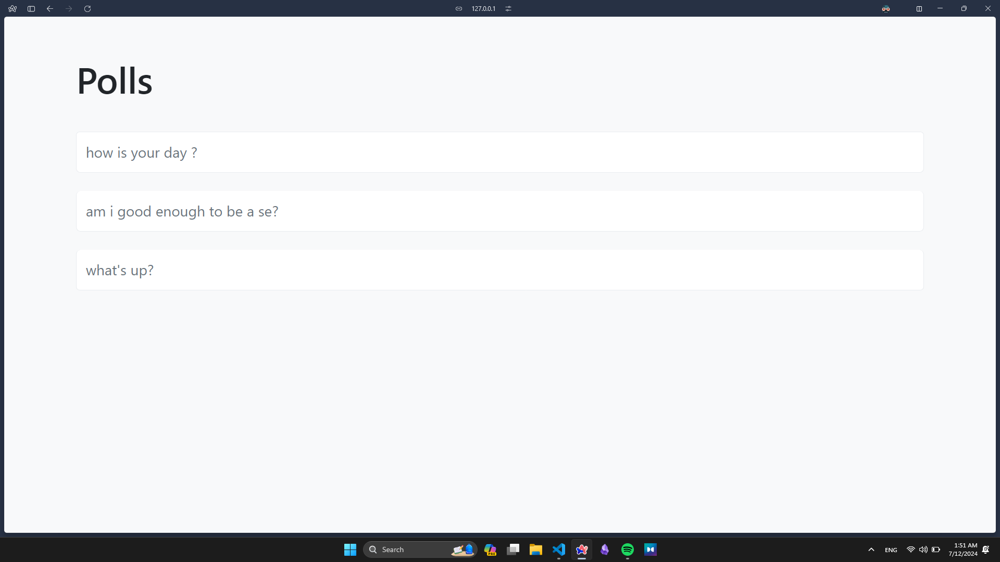
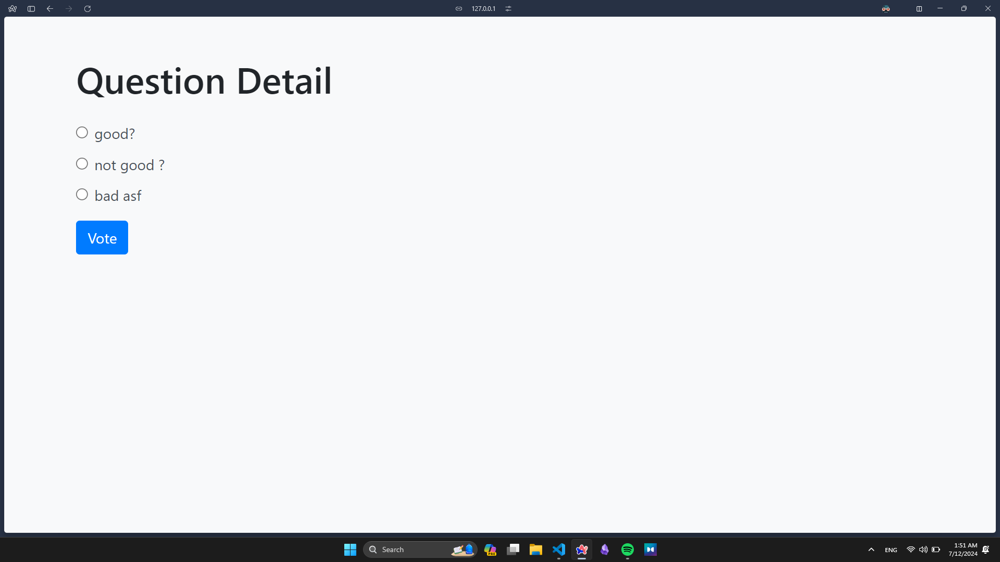
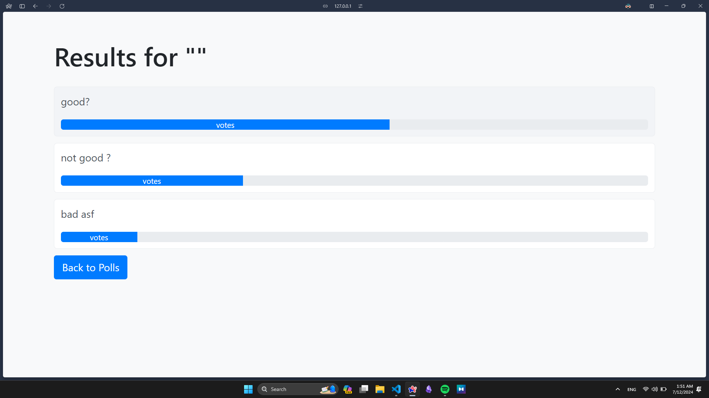

# Django Polls App


in the home page or index as in code you will find the newest five polls 

## Description

The Django Polls App is a web application designed to facilitate the creation, management, and voting on polls. It provides a user-friendly interface for both creating new polls and participating in existing ones. This app demonstrates the fundamentals of web development using Django, a powerful Python-based web framework.

## Features

- **Poll Creation**: Users can create polls with a question and multiple choices.
- **Voting**: Allows users to vote on choices for each poll.
- **Results**: Real-time display of poll results, showing percentages with progress bars for each choice.
- **Admin Interface**: Integrated Django admin interface for easy management of polls and choices.

## Technologies Used

- **Django**: Python web framework for backend development.
- **Bootstrap**: Frontend framework for responsive and appealing UI design.
- **SQLite**: Default database used by Django for development and testing.

## Screenshots






## Installation

1. **Clone the repository:**

   ```bash
   git clone <repo-url>
   cd PollsApp_withDjango
   ```

2. **Setup virtual environment:**

   ```bash
   python -m venv venv
   source venv/bin/activate  # On Windows use `venv\Scripts\activate`
   ```

3. **Install dependencies:**

   ```bash
   pip install -r requirements.txt
   ```

4. **Apply migrations:**

   ```bash
   python manage.py migrate
   ```

5. **Run the development server:**

   ```bash
   python manage.py runserver
   ```

6. **Access the application:**

   Open a web browser and go to `http://localhost:8000/polls/`

## Usage

- **Admin Interface:** Access the admin panel at `http://localhost:8000/admin/` to manage polls and choices.
- **Create Polls:** Click on "Create Poll" to add new polls with questions and choices.
- **Vote:** Users can vote on polls from the poll detail page and see the updated results instantly.

## Contributing

Contributions are welcome! If you want to contribute to this project, please fork the repository and create a pull request with your changes.

## License

This project is licensed under the MIT License. See the [LICENSE](./LICENSE) file for details.

```

### Notes:
- Replace `<repo-url>` with the actual URL of your repository.
- Update the paths for the project image (`./docs/project-image.png`) and screenshots (`./docs/Screenshot%20(45).png`, `./docs/Screenshot%20(46).png`, `./docs/Screenshot%20(47).png`) to match the actual relative paths to these images within your `PollsApp_withDjango` repository.

This README file provides a comprehensive overview of your Django Polls app, including its features, installation instructions, screenshots, usage guidelines, contribution guidelines, and licensing information. Adjust the content and paths according to your specific project setup and preferences.
